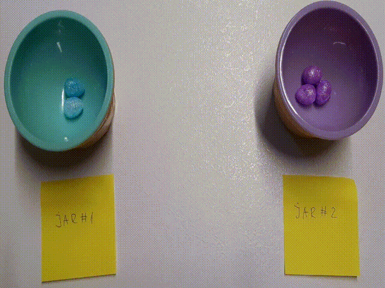

# The Budge programming language

Interpreter implementation **with example programs** in [Python](./src/budge.ipynb) and in [Haskell](./src/budge.lhs). Formalization in [Idris](./src/budge.idr).

Esolang entry: [Budge-PL](https://esolangs.org/wiki/Budge-PL).

Paper on [arXiv](https://arxiv.org/abs/2205.07979), and the source code for the paper [here](./paper).

## Introduction

Budge-PL (bʌdʒ, b'dzh) is an esoteric programming language. It uses Gödel numbering to represent registers and their values by relying on the Fundamental Theorem of Arithmetic (prime factorization). The language uses similar constructs as [FRACTRAN](https://en.wikipedia.org/wiki/FRACTRAN), however, it provides a more convenient way to construct loops and uses integers rather than fractions to denote instructions. It also abstracts prime numbers in the code, allowing for direct register access. A negative integer will decrease a register's value, while a positive integer will increase a register's value.

## Syntax and semantics

Syntax:

```
<posn>  ::= "1" | "2" | ...               <negn> ::= "-1" | "-2" | ...
<stmt>  ::= <posn> | <negn> | "("<posn>","<stmts>")"
<stmts> ::= <stmt>","<stmts> | <stmt>     <code> ::= "("<stmts>")"
```

The code is represented with lists. Let `p(n)` denote the `n`-th prime number. Let `sign(n) = 1` if `n` is positive, and `-1` otherwise; this will determine whether we need to multiply or divide. We can now define the semantics of the language, i.e., `<code>` is one of:

- Code without loops: A sequence of numbers, e.g. `(1, 2, 3)`. The semantics are such that we iterate through all numbers in the sequence, one by one until the end of the sequence is reached. In each iteration of a number `n`, calculate `i' = p(|n|)^{sign(n)}`. For the given input `i`, if `i * i'` is a natural number, set `i` the value of `i * i'`. Otherwise, do not change `i` and skip to the next instruction. The first pair of parenthesis is the program's entry point.
- Code with loops: A sequence of numbers mixed with other sequences, e.g. `(1, 2, (1, -1, 2, 3), 4)`. The instructions `n_k, n_{k+1}, ...` within `(n_0, n_1, ..., (x, n_k, n_{k+1}, ...), ...)` are repeated in a cycle until `p(|x|)` no longer divides `i`. The check is done only at the start of the iteration before calculating `n_k`. The calculation halts whenever `i * p(|x|)^{-1}` is no longer a natural number, i.e., the value of the register `x` (within `i`) is 1.

That is, the outermost sequence (main program) will not loop, and any sequence contained within it will loop based on the condition.

**For the general audience**: Imagine several jars with marbles. The command `-n` removes a marble (if any) from the jar number `n`, and `n` adds a marble to the jar number `n`. Loops can be interpreted as a way to repeat some commands while a jar `n` is not empty.



## Example program: Addition

*Input*: `2^x * 3^y`. *Output*: `2^n`.

The following code adds `x` and `y`: `((2, -2, 1))`

Here is how it will be evaluated for input: `i = 2^3 * 3^3 = 216`. We iterate until `i/p(2)` is no longer a natural number, i.e., `i/3`:

1. Initially, `i = 216`, so `216/3 = 72` which is a natural number, proceed with calculation.
2. Calculate `p(|n|)^{sign(n)}` for `n = -2`: `p(2)^{-1} = 3^{-1} = 1/3`. Since `216 * 1/3` is a natural number, set `i` to `216 * 1/3 = 72`.
3. Calculate `p(|n|)^{sign(n)}` for `n = 1`: `p(1)^{1} = 2^{1}`. Since `72 * 2` is a natural number, set `i` to `72 * 2 = 144`.
4. At this point, we go back and check the condition if `144/3` is a natural number - proceed with the calculation.
5. Calculate `p(|n|)^{sign(n)}` for `n = -2`: `p(2)^{-1} = 3^{-1} = 1/3`. Since `144 * 1/3` is a natural number, set `i` to `144 * 1/3 = 48`.
6. Calculate `p(|n|)^{sign(n)}` for `n = 1`: `p(1)^{1} = 2^{1}`. Since `48 * 2` is a natural number, set `i` to `48 * 2 = 96`.
7. At this point, we go back and check the condition if `96/3` is a natural number - proceed with the calculation.
8. Calculate `p(|n|)^{sign(n)}` for `n = -2`: `p(2)^{-1} = 3^{-1} = 1/3`. Since `96 * 1/3` is a natural number, set `i` to `96 * 1/3 = 32`.
9. Calculate `p(|n|)^{sign(n)}` for `n = 1`: `p(1)^{1} = 2^{1}`. Since `32 * 2` is a natural number, set `i` to `32 * 2 = 64`.
10. Now the condition that `32/3` is a natural number is not fulfilled, so the calculation halts.

The value of `i` is now equal to 64, which is `2^6`, i.e. the sum of `3` and `3`.

## Turing completeness

We claim Budge-PL is [Turing-complete](https://en.wikipedia.org/wiki/Turing_completeness). Since Budge-PL can multiply, divide, run a primality test for numbers, and perform code repeatedly, it can simulate FRACTRAN. Since FRACTRAN is proven to be Turing complete, so is Budge-PL.

Boro Sitnikovski, 2022
